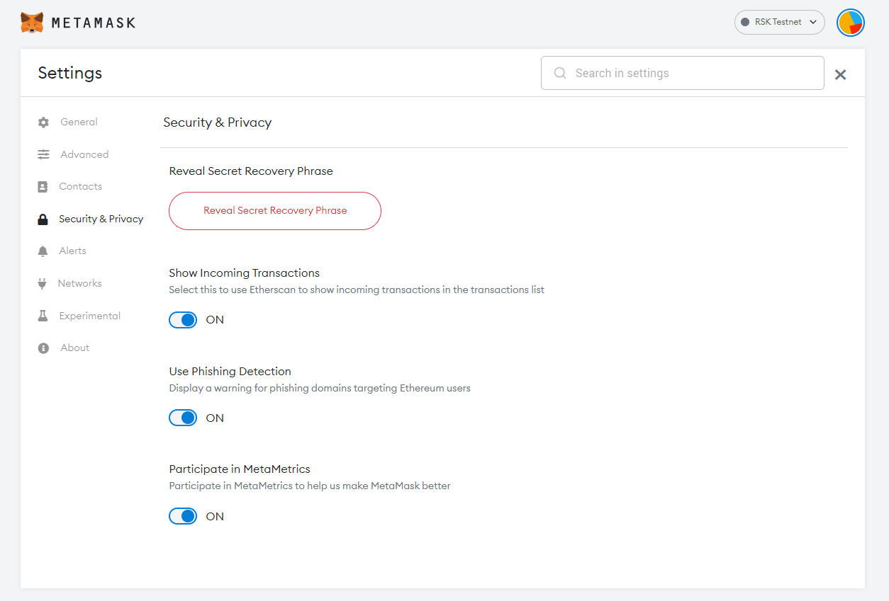
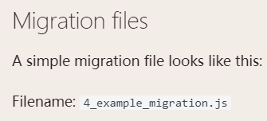
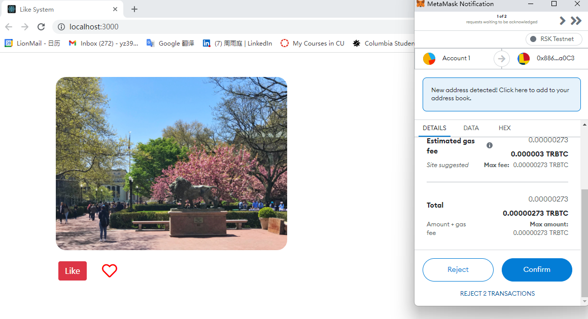
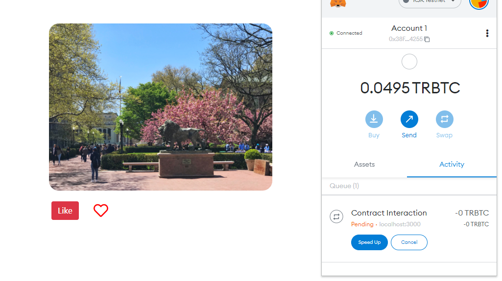
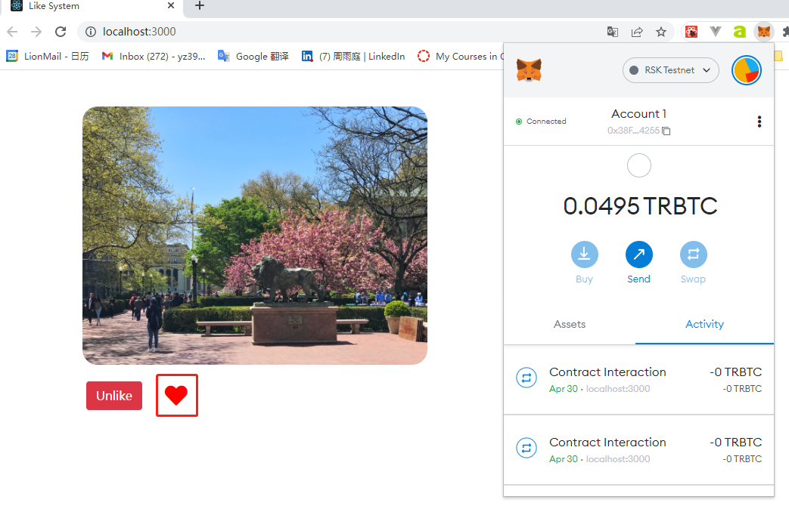
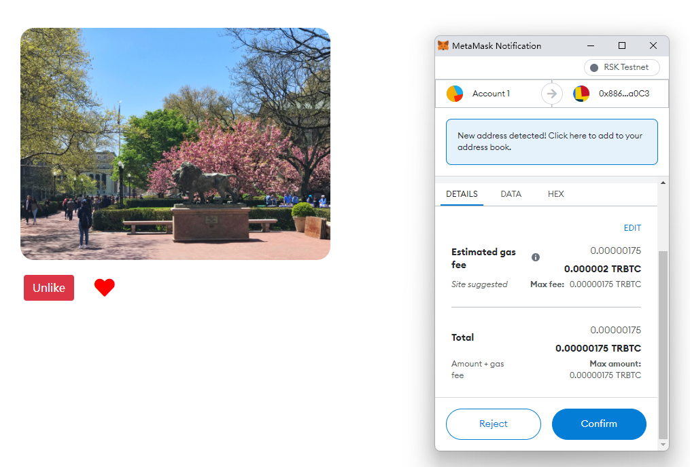
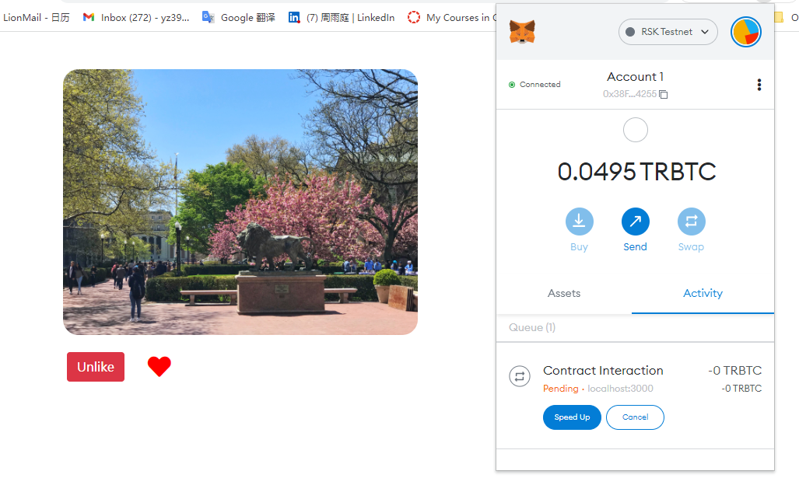
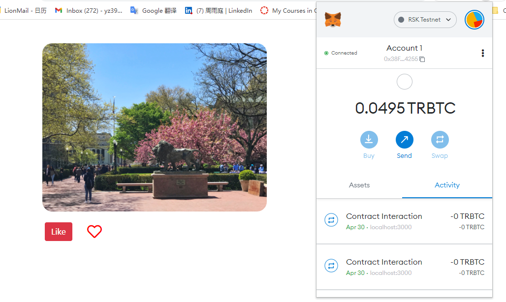

# like-system-ethereum-contract

## 1. Contract

Dependencies:

1. @truffle/hdwallet-provider

   `npm install @truffle/hdwallet-provider`

2. truffle-config.js

3. mnemonic，对应：红框

   

4. Attention:

   check the migration file names like: 

   

   必须要有一个Migrations.sol合约才能迁移。

5. deploy contract

   `truffle migrate --reset --network rsk`

6. 迁移好了之后，前端frontend文件里面会出现一个contract文件夹，包含两个json文件，也是前端找到contract钱包的方法。

## 2. frontend

首先安装几个dependencies：

`npm install ethers`

`npm install @metamask/detect-provider`

`npm install bootstrap`

## 3. Process

### 1. 初始状态

### 2. 点赞确认

### 3. 等待处理

### 4. 处理完毕，点赞完成

### 5. 取消点赞

### 6. 等待处理

### 7. 取消点赞完毕

